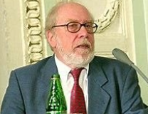

## :sparkler:데이터 구조 & 알고리즘 

> "프로그램은 **데이터 구조(저장)**와 **알고리즘(조작)**의 조합입니다"

* 프로그래밍 언어를 만들어 튜링상을 받은 컴퓨터 과학자, Niklaus Wirth의 명언입니다.

​	

:tada::loop: 그렇다면 **데이터 구조**와 **알고리즘**은 왜 중요할까요?

#### :green_heart: 데이터 구조는 

* 2가지 사실만 기억하기 :smile:
  * 컴퓨터를 사용할 때 데이터는 어떻게 하나요? 저장하고 사용합니다.
  * 이러한 데이터는 다양한 형태가 있습니다. 이 **다양한 형태의 데이터를 저장하는 바구니**를 구조라고 합니다. 그래서 어떻게 데이터를 저장할 것인지 생각해야 합니다. 예를 들어, 라뗴를 주문하면 보온병이나 플라스틱 컵에 담을 것입니다. 라떼를 샌드위치 통에 담지는 않을 것입니다. 이렇게 문제 상황마다 적합하고 효율적인 도구가 있습니다. 데이터를 적합한 곳에 담고 사용할 수 있기 때문에 퀄리티가 좋은 문제해결 방법이라는 것을 알 수 있습니다. 그래서 **데이터 구조**는 **효율적으로 문제를 풀기 위해서** 사용합니다.

​	