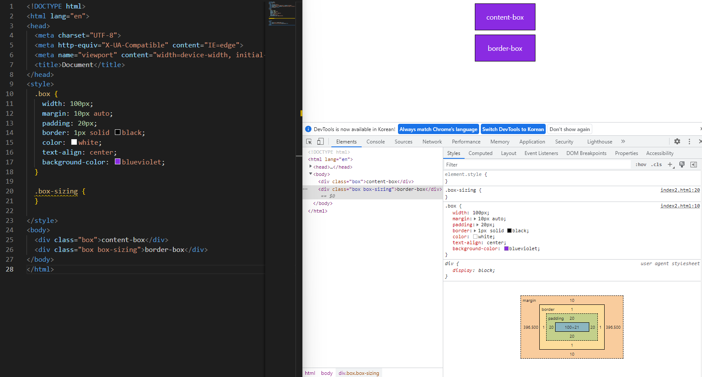
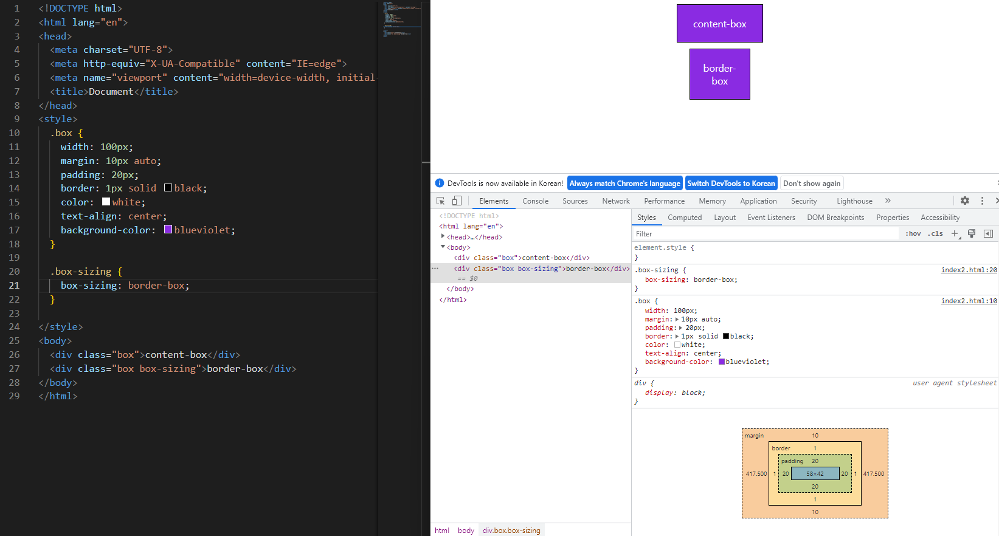

## :computer:웹 실습 원칙

* 단계적으로(상하) **네모(박스)**와 네모 안에 있는 **덩어리**를 센다.
* 가이드라인을 보면서 **태그**를 설계한다.
  * 네모 안의 덩어리들을 **묶는** 태그를 반드시 기억한다.

* 설계를 **반드시** 해놓고 시작한다.

## :sparkles:웹 기초

* **Block Direction**을 기억한다.

* margin: auto 

  * 수평 방향으로 또는 좌우의 마진값을 자동 설정합니다.

* box-sizing을 입히지 않았을 때와 입혔을 때의 차이점

  

  

* CSS 원칙
  * 모든 요소는 박스(네모)모델 이며 왼쪽 상단부터 자리를 잡습니다.
  * display는 크기과 배치를 바꿉니다.
* CSS Display
  * display: block
    * 세로로 정렬
  * display: inline
    * 가로로 정렬
  * Block의 특징을 가지는 블록 레벨 요소
    * div / ul, ol, li / p / hr / form 
  * Inline의 특징을 가지는 인라인 레벨 요소
    * span / a / img / input, label / b, em, i, strong 