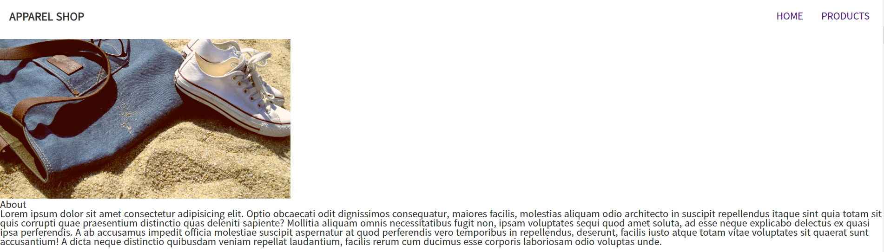
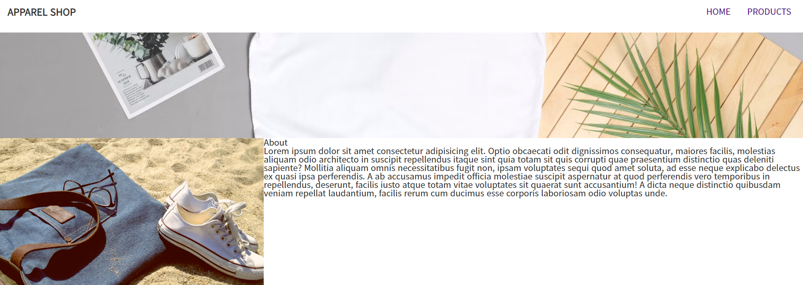

## 웹 기초

* Navigation Bar의 a태그 너비와 높이 지정
  * **너비**를 지정하지 않으면 기본적으로 부모의 영역만큼 너비를 상속받고 **높이**는 내부 컨텐츠만큼 상속 받습니다. 너비가 지정되어 있지 않은 상태에서 flex를 하면 컨텐츠만큼 너비가 줄어듭니다. 이렇게 너비나 높이를 지정해야 하는 상황들이 많이 발생합니다. 

* **ul태그에 기본 Margin이 있습니다.** ul태그에 nav-list라는 class가 부여되어 있어서 margin을 0으로 만들어야 합니다.

* **보라색 공간의 의미**는 '보라색 공간만큼 크기를 더 늘릴 수 있는데 안에 있는 것이 작다'라는 뜻입니다.

* margin과 padding은 디자이너의 영역입니다.

* background-image에 url 설정

  * 절대 경로
    * background image에  url을 넣을 때 주소의 시작이 **슬래쉬(/)**이면 절대 경로라는 뜻입니다. 슬래쉬를 붙이는 패턴은 서버에서 사용합니다.
  * 컨텐츠 영역이 비어있으면 비어있기 때문에 높이를 따로 설정해 주어야 합니다.

  ```css
  .banner {
      background-image: url('../assets/apparel.jpeg');
  }
  ```


* 이미지와 배경 이미지(background image)의 차이점

  * 이미지는 어떠한 목적을 가지고 **마크업**이 되어있고 배경 이미지는 **CSS의 타입**입니다.

    

* **display: flex**

  * 수평 방향으로 정렬

  * display flex 전

    

  * display flex 후

    


* Overlay 
  * overlay는 display를 조작하거나 투명도를 조작합니다.
    * display를 바꾸는 형식 등 여러 방식이 있습니다.
      * display: none;
      * display: block;
      * fade in overlay


* HTML <section> 태그

  * `부분`이라는 뜻

  * 독립적인 부분(section)

  * 제목 요소(h1~h6)를 자식 요소로 생각하기도 합니다.

    

* HTML <div> 태그

  * `어떤 영역` 또는 `특정 영역`이라는 뜻
  * 블록 타입
  * 다양한 HTML 타입들 (예를 들어, image, text 등)을 하나의 묶음으로 표헌합니다.
  * 스타일 입힐 때 **컨테이너(container)**로 쓰입니다.
    * div class="container"


* HTML <span> 태그
  * **인라인 요소**를 한묶음으로 표현할 때 사용합니다.