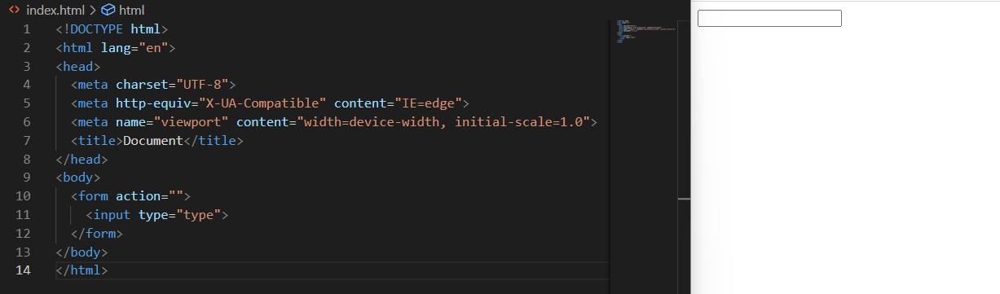
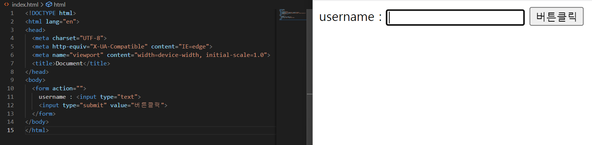
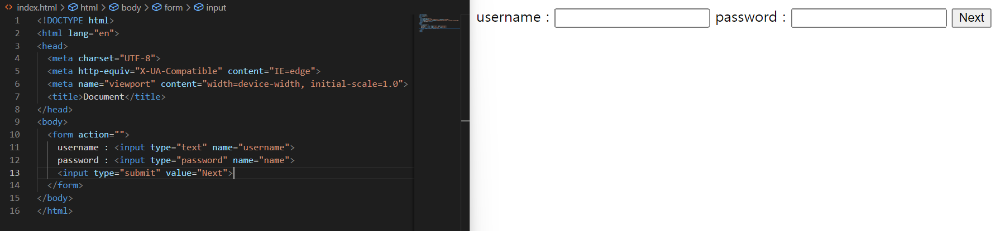
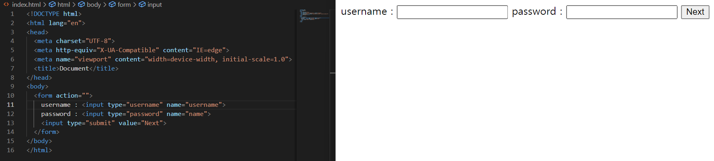

## HTML

* HTML 문서 구조화

  * thead (header)

    * 테이블의 header
    * thead의 셀(cell)은 th

  * tbody (body)

    * 테이블의 body
    * tbody의 셀은 td

  * tfoot (footer)

    * 테이블의 footer
    * tfoot의 셀은 td

    | ID    | Country     | Country Code |
    | ----- | ----------- | ------------ |
    | 1     | South Korea | 82           |
    | 2     | France      | 33           |
    | Total | 2           |              |

  * tr

    * 가로줄

  * 셀 병합

    * colspan
      * 열의 셀을 병합
    * rowspan
      * 행의 셀을 병합

  * <caption>

    1그룹 여행자 명단 caption

    * 표의 제목이나 설명입니다.

  

  * Table의 태그 구조

    ```html
    <body>
        <table>
            <thead>
              <tr>
                <th>ID</th>
                <th>Country</th>
                <th>Country Code</th>  
              </tr>
            </thead>
            <tbody>
              <tr>
                <td>1</td>
                <td>South Korea</td>
                <td>82</td>    
              </tr>
              <tr>
                <td>2</td>
                <td>France</td>
                <td>33</td>    
              </tr>
            </tbody>
            <tfoot>
              <tr>
                <td>Total</td>
                <td>colspan="2">2</td>
              </tr>
            </tfoot>
            <caption>1그룹 여행자 명단</caption>
        </table>
    </body>
    ```

    


## Form 태그

* 어떤 form이 있는가?
  * 로그인 form
  * 설문지 form
  * Google form
    * form에 있는 모든 구성 요소가 input 태그로 되어있습니다. 

* 언제 사용하는가?
  * **데이터를 서버에 보낼 때** 
  
* Form 태그의 속성은?
  * **action**
    * form을 작성하면 서버에 제출됩니다. **서버에 제출이 되는 주소** 입니다.
    
    * 네이버에 검색하면 주소의 결과가 나옵니다.
    
      


## Input 태그

* Input을 사용했을 때 입력창 생성

  


* username : <input type="text">

  


* password : <input type="password" name="name">

  


* input의 type은 다양합니다.

  * input의 type이 username일때

    


* input 요소는 **인라인** 요소

* 처음 태그를 보았을 때 태그가 어떤 기본 display를 지녔는지 반드시 알아야 합니다.

  
