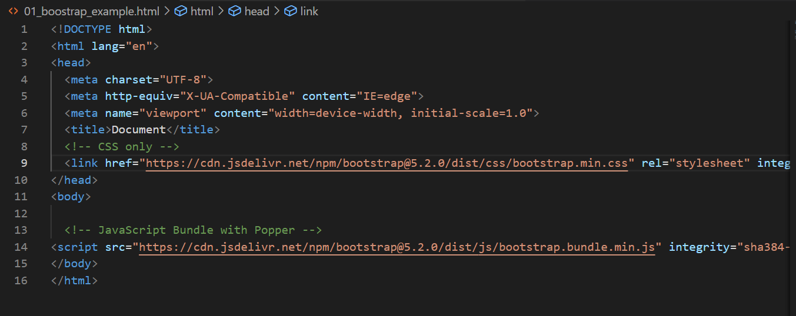
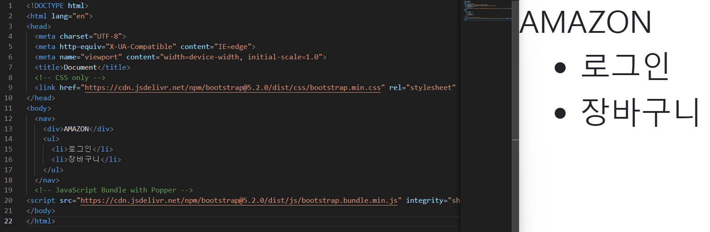
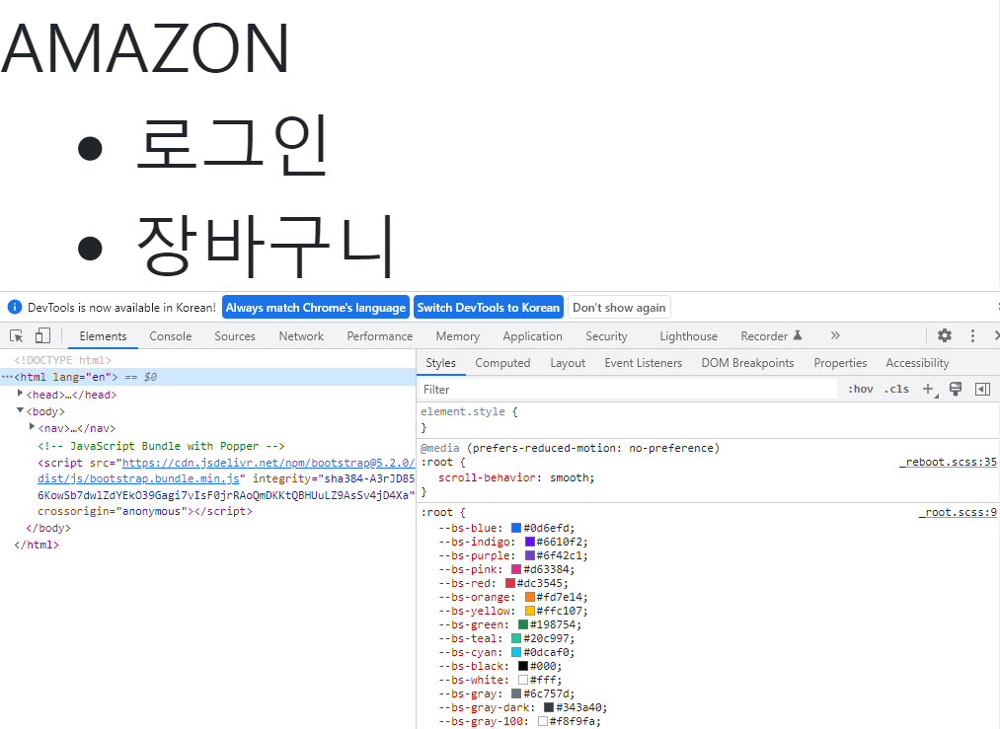

## Bootstrap 활용 실습

* Bootstrap을 **어떻게 활용**해서 **개발**을 할 수 있는가?

  

* Bootstrap?

  * 미리 다른 개발자에 의해 작성된 CSS와 Javascript 코드
  * 내가 원하는 모습을  맞춤 제작(customizing)
    * html css가 어떤 **구조**의 코드로 되어있는지 **해석**할 수 있는 역량 필요


* Bootstrap 기초

  * Bootstrap을 사용하기 위해서 첫번째로 해야하는 것

    * CSS를 수입하기(가져오기)

      * 메인 페이지에 Include via CDN 복사

        ```css
        <!-- CSS only -->
        <link href="https://cdn.jsdelivr.net/npm/bootstrap@5.2.0/dist/css/bootstrap.min.css" rel="stylesheet" integrity="sha384-gH2yIJqKdNHPEq0n4Mqa/HGKIhSkIHeL5AyhkYV8i59U5AR6csBvApHHNl/vI1Bx" crossorigin="anonymous">
        
        
        <!-- JavaScript Bundle with Popper -->
        <script src="https://cdn.jsdelivr.net/npm/bootstrap@5.2.0/dist/js/bootstrap.bundle.min.js" integrity="sha384-A3rJD856KowSb7dwlZdYEkO39Gagi7vIsF0jrRAoQmDKKtQBHUuLZ9AsSv4jD4Xa" crossorigin="anonymous"></script>
        ```

        

        

      

      * Quick Start에 CDN via jsDeliver에서도 찾아볼 수 있습니다.

  

  

  * Bootstrap 5 Quick Snippets

  * Bootstrap 5 & Font Awesome Snippets(코드 조각)
    * 라이브러리에 있는 코드 조각을 매핑시켜 놓은 세상 (직접 적용 연습 필요함)
      * bs5-$
        * header, main, footer 
          * 구조 자동화
      * bs5-form
      * bs5-nav


* Bootstrap 적용

  * Margin이 없는 것을 보면 Bootstrap이 적용되었다는 것을 알 수 있습니다.

    

  

  * 개발자 도구

    * 어떤 파일이 CSS에 적용되고 있는지 항상 확인을 해야합니다.

    * user agent stylesheet 

      * 크롬 기본 속성

    * reboot.scss

      * Bootstrap이 적용되고 있는 초기화된 기본

        

  * 높이 

    * 높이는 직접 지정해야 합니다.

  * container

    * 많이 사용하는 태크

      ```css
      <div class="container">
      ```

    * 사이트마다 여백 조정을 다르게 해놓았는데 사이트 크기를 줄이면 여백 자체가 줄어드는 곳이 있습니다. 그리고 반대로 크기를 늘리면 같이 부풀어집니다. 이러한 공간을 **컨테이너**라고 합니다. Grid system에서 사용합니다.


* Bootstrap Components
  * 스타일과 Javascript 부분이 있습니다.
  * Accordion
    * **id와 data-bs-target**를 일치(매핑)시켜야 버튼이 동작합니다.