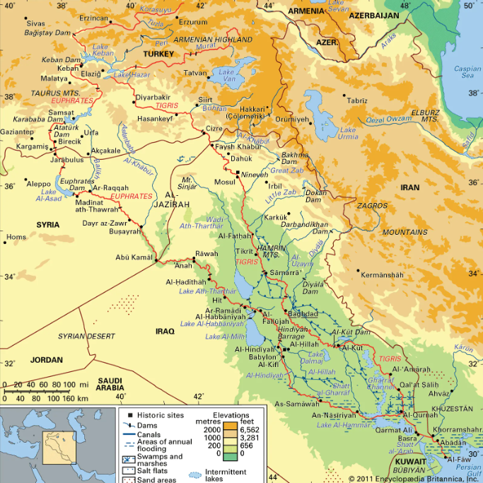

## Bootstrap Grid System (Web design)

* Bootstrap 어떻게 **시작**하는가?

  

  * 먼저 Compiled **CSS** and **JS** 다운로드
    * https://getbootstrap.com/docs/5.2/getting-started/download/ 
    * CSS와 Javascript가 다운로드 됩니다.
      * **CSS**에 많은 종류의 파일이 있는 것을 볼 수 있습니다.
        * 어떠한 **구조**로 구성되어 있는가? 어떠한 **역할**을 하는가?
          * **grid.css**
            * grid.min.css
              * grid와 grid.min의 차이점
                * 용량의 차이
                  * min은 공백(띄어쓰기)과 개행을 제거해서 minified되었다 라는 의미 
                  * dot이 붙은 형식은 이러한 공백이 제거되었다고 생각하면 됩니다.
            * grid.rtl.css
              * right to left(rtl), 즉 오른쪽에서 왼쪽 방향으로 보는 형식
            * grid.rtl.min.css
          * **utilities.css**
            * utilities.min.css
            * utilities.rtl.css
            * utilities.rtl.min.css
          * **Bootstrap** 
            * Bootstrap-grid
            * Bootstrap-reboot
              * 다른 컴포넌트를 적용하지 않고 크롬에 기본 스타일을 제거해서 Bootstrap-reboot을 활용할 때 유용합니다. Bootstrap의 모든 것이 아니라 어떠한 부분만 사용할 때 필요합니다.
            * Bootstrap-utilites
      * **Javascript**
        * bootstrap.bundle, bootstrap.bundle.min 등을 사용합니다.
  * 결국, CDN 서버에서 가져오는 방법과 **내가 직접 다운로드 받아서 사용하는 방법**이 있습니다. 


* Grid system이란?

  * 아마존 사이트에 들어가면 다양한 상품들의 이미지를 한눈에 볼 수 있습니다.

    * 이렇게 이미지의 **디자인**과 **배치**를 쉽게 만들어 주는 시스템을 Grid System이라고 합니다.

  * 격자무늬, 격자판

    * Grid는 천이나 바둑판에서 흔히 볼 수 있는 '격자무늬' 또는 '격자판'을 의미합니다. Grid System은 바둑판에서 흔하게 볼 수 있는 패턴을 닮았습니다.

  * Grid system의 요소

    * Column
      * 컨텐츠의 영역
      
    * Gutter
      * 컨텐츠 사이의 영역
      
      * 홈통, 도랑이라는 다양한 뜻이 있으며 단어 자체가 `통로`라는 모습을 나타내기 때문에 컨텐츠 사이의 공간을 연상할 수 있습니다. 
      
        
      
    * Container
      * 컨텐츠를 보관하는 영역
  
  * Bootstrap Grid System
  
    * Grid System은 Flexbox로 만들어졌습니다.
    * 컨텐츠를 움직이려면?
      * column, rows, container을 사용해야 합니다.
    * Bootstrap Grid System의 핵심
      * 12개의 **Column**
      * 6개의 **Grid Breakpoints**
        * Breakpoint는 구분점이라는 뜻이며 px(픽셀)의 단계적 표준점을 나타냅니다.
          * xs, s, md, lg, xl, xxls
  
  * Grid System 코드 구조
  
    ```html
    <div class="container">
        <div class="row">
            <div class="col"></div>
            <div class="col"></div>
            <div class="col"></div>     
        </div>
    </div>
    ```


* Citation
  * https://www.britannica.com/place/Tigris-Euphrates-river-system
