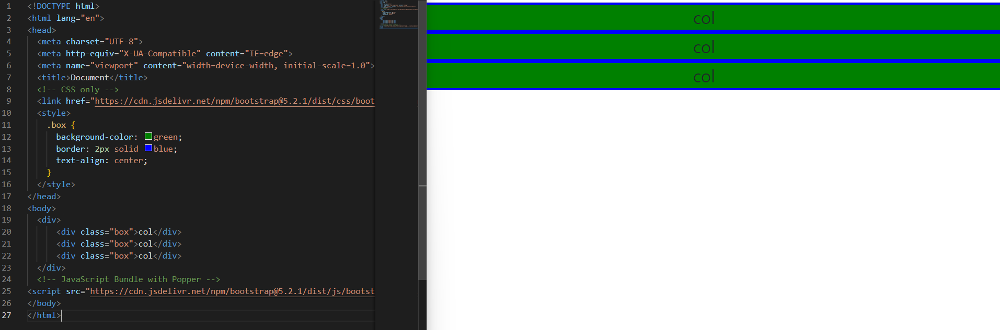
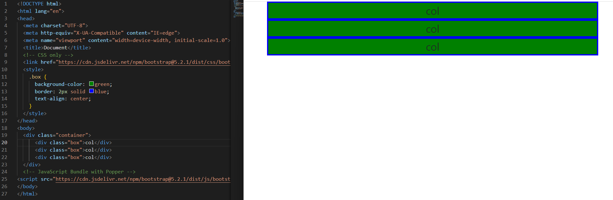
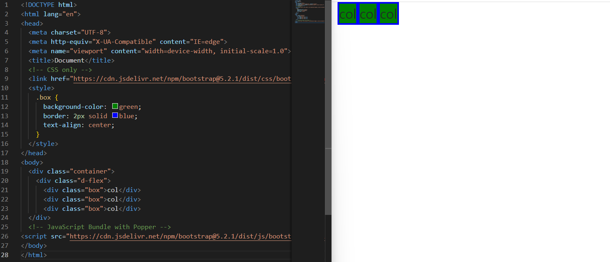
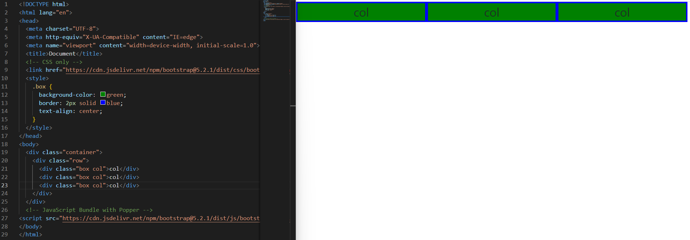
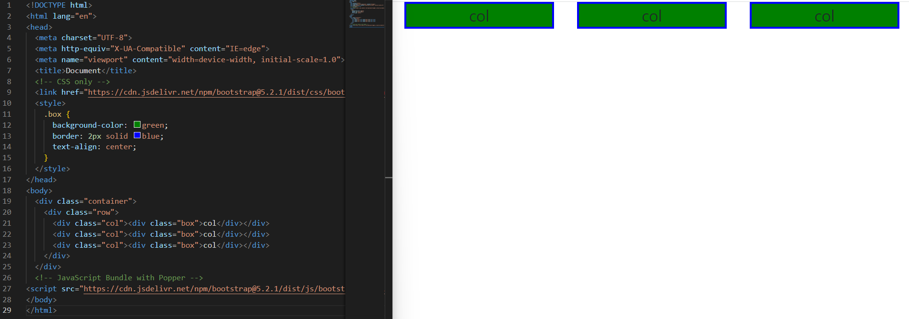

## Grid System

* Grid System 단계적 이해

  ```html
    <div>
        <div class="box">col</div>
        <div class="box">col</div>
        <div class="box">col</div>
    </div>
  ```

  


* Grid System container

  ```html
  <div class="container">
        <div class="box">col</div>
        <div class="box">col</div>
        <div class="box">col</div>
    </div>
  ```

  

  

  

* Grid System d-flex

  ```html
  <div class="container">
      <div class="d-flex">
        <div class="box">col</div>
        <div class="box">col</div>
        <div class="box">col</div>
    </div>
  ```

  


* Grid System <div class="box col">

  ```html
    <div class="container">
        <div class="row">
            <div class="box col">col</div>
            <div class="box col">col</div>
            <div class="box col">col</div>
            </div>
        </div>
  </div>
  ```

  


* Grid System <div class="box">

  ```html
   <div class="container">
      <div class="row">
        <div class="col"><div class="box">col</div></div>
        <div class="col"><div class="box">col</div></div>
        <div class="col"><div class="box">col</div></div>
      </div>
    </div>
  ```

  


