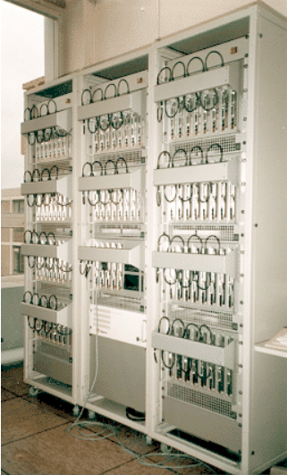

## 아메바(Amoeba) 분산 운영 체제

* 앤드루 타넨바움(Andrew S. Tanenbaum)이 Vrije Universiteit Amsterdam에서 개발한 분산 운영 체제입니다. 

* 시분할(Time Division) 운영 체제는 사용자에게 컴퓨터의 네트워크를 싱글 머신으로 인지하도록 돕는 체제입니다. 파이썬이 아메바 운영 체제를 기반으로 탄생했습니다. 

* 학계, 정부, 산업에서 5년 동안 사용했었지만 현재는 프로젝트가 중단되었습니다.

  

  

Citation: https://www.cs.vu.nl/pub/amoeba/amoeba.html