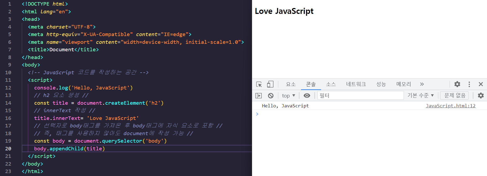

## JavaScript

* JavaScript

  * 핵심은 **'동적 언어'** 입니다.
    * 브라우저 화면을 동적으로 만들기 위해서 활용하는 언어입니다.
  * 비 브라우저 환경에서도 쓰이고 있으며 `ECMAScript6+` 환경을 표준화로 선정했습니다.
  * 서버 사이드 기능을 확장할 수 있는 Node.js를 제공합니다.
    * 서버 사이드 기능
      * 서버에서 파일 조작
  * 객체 기준 라이브러리를 사용할 수 있습니다.
    * Array
    * Date
    * Math

* DOM(Document Object Model)

  * HTML 조작

  * 어떻게 시작하는가?

    * JavaScript 영역 생성

      

    

    * console.log

      * 개발자 도구의 console 창에서 실행이 됩니다.

        * console과 console창은 반드시 기억합니다.

        

      * console창에서 코드 작성

        

      * const body = document.querySelector('body')

        * const
          * 변수를 선언할 때 키워드를 사용합니다.

        ```html
        <!DOCTYPE html>
        <html lang="en">
        <head>
          <meta charset="UTF-8">
          <meta http-equiv="X-UA-Compatible" content="IE=edge">
          <meta name="viewport" content="width=device-width, initial-scale=1.0">
          <title>Document</title>
        </head>
        <body>
          <!-- JavaScript 코드를 작성하는 공간 -->
          <script>
            console.log('Hello, JavaScript')
            // h2 요소 생성 //  
            const title = document.createElement('h2')
            // innerText 작성 //
            title.innerText= 'Love JavaScript'
            // 선택자로 body태그를 가져온 후 body태그에 자식 요소로 포함 //
            // 즉, 태그를 사용하지 않아도 document에 작성 가능 //
            const body = document.querySelector('body')
            body.appendChild(title)    
          </script>
        </body>
        </html>
        ```

        

        

      

      

    * typeof

      ```html
      typeof()
      ```

    * Event 

      ```html
      <body>
        <h1>Event</h1>
        <button id="evt">이벤트</button>
      
        <script>
          const evt = document.querySelector('#evt')
          evt.addEventListener('click', function() {
            alert('이벤트 클릭')
          }) 
        </script>
        
      </body>
      ```

      