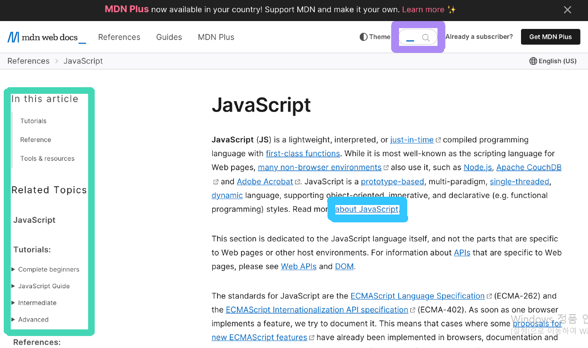

## JavaScript

* Event

  * 사건의 발생을 나타냅니다

  * Event의 핵심은 "어떤 이벤트가 발생하면 동작을 함수 입력을 통해 실행시킨다"

  * Event를 사용했을 경우

    * keydown, mouseover, click 등

      

  

  * Event Handler 구조

    ```javascript
    target.addEventListener(type, listener[, options])
    ```

    

  * Event 취소

    * 이벤트의 기본 동작을 멈추게 하는 기능입니다.

      ```javascript
      event.preventDefault()
      ```

      

* Bubbling

  * 트리 구조로 되어있는 HTML 요소에 이벤트가 발생되면 상위에 있는 요소에게 전달이 되는 것을 `버블링`이라고 합니다.