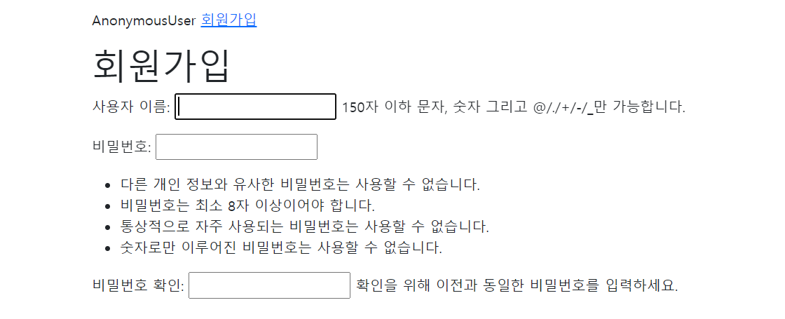

## Accounts 시작, 회원가입 기능 구현

* 어떻게 시작하는가

  ```python
  앱 생성
  python manage.py startapp accounts
  
  앱 등록
  settings.py에
  'accounts'
  
  URL 분리 작업 기본 세트
  1. accounts에 urls.py 생성
  2. pjt의 url.py에 path('accounts/', include('accounts.urls'))
  3. accounts의 url.py에 urlpatterns = [] 빈 리스트 생성
  	- app_name = 'accounts'
  
  
  사용자 관리 위해서 무엇을 만들어야 하는가?
  DB 필요
  모델 정의를 해야함. 어떻게? class User
  User에 들어가는 필드는?
  User 모델은 이미 auth_user로 존재했음
  이미 내장되어 있는 모델을 사용함
  직접 사용하기 위해서 이 모델을 가져와야함
  어떻게? Class 상속
  모델에 있는 User는 어떤 필드를 가지고 있나?
  Username, Firstname, Lastname, Email, Password,
  속성은 is_authenticated 인증이 되었는가?  
  객체를 보면 객체로 무엇을 할 수 있는지 판단할 수 있음 (다양한 속성과 메서드)
  User 모델 활용할 때 Custom User Model로 대체해서 활용할 것이다.
  맞춤설정이 필요한 경우가 있음. 예를 들어, 사용자의 추가적인 정보가 더 필요할 경우 모델 필드를 추가해야함
  모델을 변경한다는 것은 'DB가 변경되었다'라는 의미
  그래서 내가 미리 설정해 놓아야함
  따라서 기존 모델을 다른 모델로 변경할 때, 필드를 변경하거나 추가하기 위해서 추가 설정이 필요함
  settings.py에 
  AUTH_USER_MODEL = 'auth.User'를 AUTH_USER_MODEL = 'accounts.User'로 변경 
  
  모델 상속
  내부에 있는 모델을 가져온다
  models.py에
  
  from django.db import models
  # AbstractUser를 상속받겠다
  from django.contrib.auth.models import AbstractUser
  
  class User(AbstractUser)
  	pass
  
  
  기존의 db.sqlite3 삭제한다
  python manage.py makemigrations
  python manage.py migrate
  
  python manage.py createsuperuser
  사용자 이름: admin
  Password: 
  
  db.sqlite3에 accounts_user에 저장됨
  여기까지 모델을 직접 정의한 것이 아니라 장고 내부에 있는 것을 가져와서 바로 migrate까지 진행함
  
  
  AbstractUser는 무엇인가?
  다양한 설정이 있음. username, first_name, last_name, email, is_staff, is_active 등
  AbstractUser는 AbstractBaseUser를 상속받고 있음. AbstractBaseUser는 models.Model을 상속받고 있음. 
  AbstractUser를 상속받아서 Custom을 한것임
  
  
  ```

  

* User 모델 활용한 CRUD

  ```python
  pip install django-extensions
  
  앱등록
  'django-extensions'
  
  pip freeze > requirements.txt
  
  pip install ipython
  
  python manage.py shell_plus
  
  User 생성하기(저장)
  Article.objects.create(title='제목1', content='내용1')
  
  User는 object.create할때 어떤 정보가 있어야하나?
  User.objects.create(username='sun', password='1q2w3e4r')
  비밀번호가 그대로 저장됨
  User는 password를 암호화하는 로직이 들어가야 해서 create할 때 username, password 정보 추가 중요
  
  암호화를 위해서 장고는 추가적인 설정을 지원한다
  장고는 PBKDF2 알고리즘을 사용하고 있음
  Password-Based Key Derivation Function
  
  비밀번호가 암호화되서 저장이됨
  User.objects.create_user('mark', 'mark@gmail.com', '1q2w3e4r')
  
  User.objects.create_user('harper', 'harper@gmail.com', '1234')
  
  mark와 harper의 비밀번호가 일치하는지 확인하려면 authenticate 함수를 사용함
  
  from django.contrib.auth import authenticate
  authenticate(username='mark', password='1234')
  비밀번호가 틀리면 객체를 보여주지 않음
  인증 여부를 확인할 수 있음
  
  결론은 비밀번호가 일치하는지 여부를 확인해주는 함수가 내장되어 있음. User를 저장할 때 사용할 수 있는 메서드도 있음.
  
  ```

  

* 직접 회원가입 기능 만들기

  ```python
  accounts앱의 urls.py에 
  from django.urls import path
  from . import views
  
  app_name = 'accounts'
  
  urlpatterns = [
    path('signup', views.signup, name='signup'),
  ]
  
  
  views.py에
  def signup(request):
       return render(request, 'accounts/signup.html')
      
      
  accounts 폴더에 templates\accounts
  signup.html 생성
  form을 제공해야함
  회원가입 form은 어떻게 제공?
  회원가입 form은 user와 연결된 ModelForm이 필요함
  
  
  views.py에
  from django.contrib.auth.forms import UserCreationForm
  def signup(request):
    form = UserCreationForm()
    context = {
      'form': form
    }
    return render(request, 'accounts/signup.html', context)
  
  
  signup.html에
  {{ form.as_p }}
  추가하면
  사용자 이름, 비밀번호, 비밀번호 확인이 추가됨
  ```

  

  ```python
  form을 주는 기능을 완료했음
  
  회원가입 처리와 유효성 검사를 해야함
  from django.contrib.auth.forms import UserCreationForm
  
  def signup(request):
      # POST 요청 처리
      # request의 method가 POST라면 회원가입 처리를 해줘야 하고
      if request.method == 'POST':
          # ModelForm로직의 기본
          # 유효성 검사
          # 사용자가 입력한 값을(request.POST) form에 넣음
          form = UserCreationForm(request.POST)
          # 질문: valid한가? 
          if form.is_valid():
              form.save()
              return redirect('articles:index')
      # GET 요청일 때
      # 나머지는, GET 요청일때는 Form을 UserCreationForm을 넣어서 
      else:
          form = UserCreationForm()
      # signup.html에 {{ form.as_p }}로 사용함
      context = {
        'form': form
      }
      return render(request, 'accounts/signup.html', context)
  
  
  이렇게 작성하면 오류
  Manager isn't available; 'auth.User' has been swapped for 'accounts.User'
  왜? 
  Manager는 무엇?
  ORM에서 models.Model을 상속 받는 이유
  Article.objects의 objects는 manager이 실행함
  settings.py 원래 기본 설정이 auth.User였는데 accounts.User로 변경했음
  UserCreationForm은 ModelForm을 상속받음
  그래서 accounts에 정의한 user로 변경해야함
  class Meta:
      model = User을 변경해야함
  바꾸려면 어떻게?
  다시 상속 받아야함
  forms.py 생성
  
  
  
  forms.py에
  다시 상속을 받는다
  from django.contrib.auth.forms import UserCreationForm
  from .models import User
  
  class CustomUserCreationForm(UserCreationForm):
  
      class Meta:
        # 내가 가지고 있는 User Model = models.py에 내가 상속받은 Model
        model = User
        fields = '__all__'
  
      
      
  views.py에
  # from django.contrib.auth.forms import UserCreationForm
  from .forms import CustomUserCreationForm
  
  
  def signup(request):
      # POST 요청 처리
      # request의 method가 POST라면 회원가입 처리를 해줘야 하고
      if request.method == 'POST':
          # ModelForm로직의 기본
          # 유효성 검사
          # 사용자가 입력한 값을(request.POST) form에 넣음
          form = CustomUserCreationForm(request.POST)
          # 질문: valid한가? 
          if form.is_valid():
              form.save()
              return redirect('articles:index')
      # GET 요청일 때
      # 나머지는, GET 요청일때는 Form을 UserCreationForm을 넣어서 
      else:
          form = CustomUserCreationForm()
      # signup.html에 {{ form.as_p }}로 사용함
      context = {
        'form': form
      }
      return render(request, 'accounts/signup.html', context)
  
  
  사용자가 입력하는 Form의 모든 작성 사항들이 나오는데 
  username과 password만 보여주려면
  fields에 fields = {'username', 'password'} 설정을 하면됨
  
  class Meta:
        # 내가 가지고 있는 User Model = models.py에 내가 상속받은 Model
        model = User
        fields = ('username', 'password')
          
          
  signup.html에 
  아이디, 비밀번호 제출하면 db.sqlite3의 accounts_user에서 확인가능
  
  accounts의 admin.py에서
  from django.contrib import admin
  from .models import User
  
  admin.site.register(User)
  
  localhost/admin에서 사용자(들) 확인
  
  회원가입 기능 완료
  ```

  