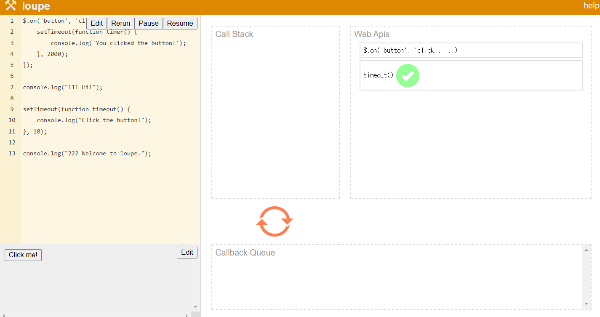

## AJAX

* 비동기식 Asynchronous

  * 요청 보내고 응답 기다리지 않고 다음 코드가 실행됨

* 시작

  ```python
  python test.py
  
  pip install requests
  
  # console
  const request = new XMLHttpRequest()
  const URL = 'https:/jsonplaceholder.typicode.com/todos/1'
  request.open('GET', URL)
  request.send()
  const todo = request.response
  consol.log(todo)
  
  todo
  
  
  # Javascript 특징
  Call Stack
  	먼저 쌓인 것이 먼저 나가지 않음
  Task Queue
  	들어온 순서대로 나감
  
      
      
  console.log('hi')
  # 몇초가 지나면 ~ 동작
  setTimeout(function() {
      console.log('작업중')
  })
  console.log('bye')
  
  
  
  원래 실행 순서
  1. console.log('hi')
  2. setTimeout (setTimeout이 Web Apis에 던져져 있음)
  3. console.log 실행
  
  
  
  test.py에서
  파이썬에서는 요청이 도착할때까지 (10초)기다렸다가 response에 저장하고 그 다음을 실행
  
  import time
  
  print('hi')
  time.sleep(10)
  print('bye')
  
  
  
  
  실제 실행 순서 (EventLoop 형식으로 동작됨)
  1. console.log('hi')
  2. console.log 실행
  3. setTimeout (완료되면 Callback Queue로 넘겨짐, Call Stack 비어져있으면 Callback Queue에서 올려짐)
  
  
  JS는
  요청이 도착하는 것 안 기다림(그냥 Web API에 던져놓음)
  그리고 그냥 다음을 실행해버림
  그리고 도착하면 무엇인가를 함
  
  
  ```

  